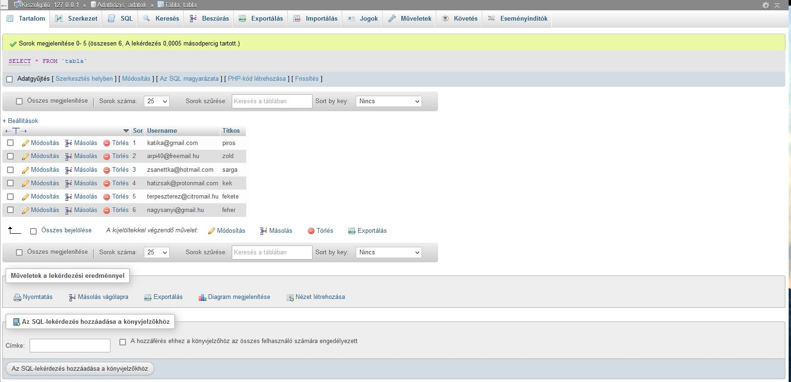

# PHP-Project
Basic login project in PHP using SQL as database and encoded txt file with hungarian data 

Ez egy PHP és SQL projekt amiben egy bejelentkezési felületet kellett létrehozni. A regisztrált emailek és a hozzájuk tartozó jelszavak kódolva vannak egy txt állományban. A feladat az volt, hogy a txt állományból dekódolni kellet az emailcímeket és a hozzájuk tartozó jelszót majd ellenőrizni hogy a bejelentkezéskor ezek közül valamelyik párost adtuk e meg. Ha igen akkor az adatbázisból a bejelentkezett emailcímhez tartozó színt kellett elérni és olyan színűre kellet befesteni a hátteret. Helytelen email megadása esetén hiba üzenet. Helytelen jelszó megadása esetén átirányítás a police.hu weboldalra.

A Kódolt txt állomány dekódolt adatai amivel be lehet jelentkezni és
az emailcímhez rendelt kedvenc színt megjeleníteni:

* katika@gmail.com -> katica85
* arpi40@freemail.hu -> polip
* zsanettka@hotmail.com -> csillag12
* hatizsak@protonmail.com -> tracking
* terpeszterez@citromail.hu -> cukorka
* nagysanyi@gmail.hu -> julcsika

A projekt felülete elérhető:

[Itt](http://csirakdavid-web.freecluster.eu/)

Az adatbázis:

